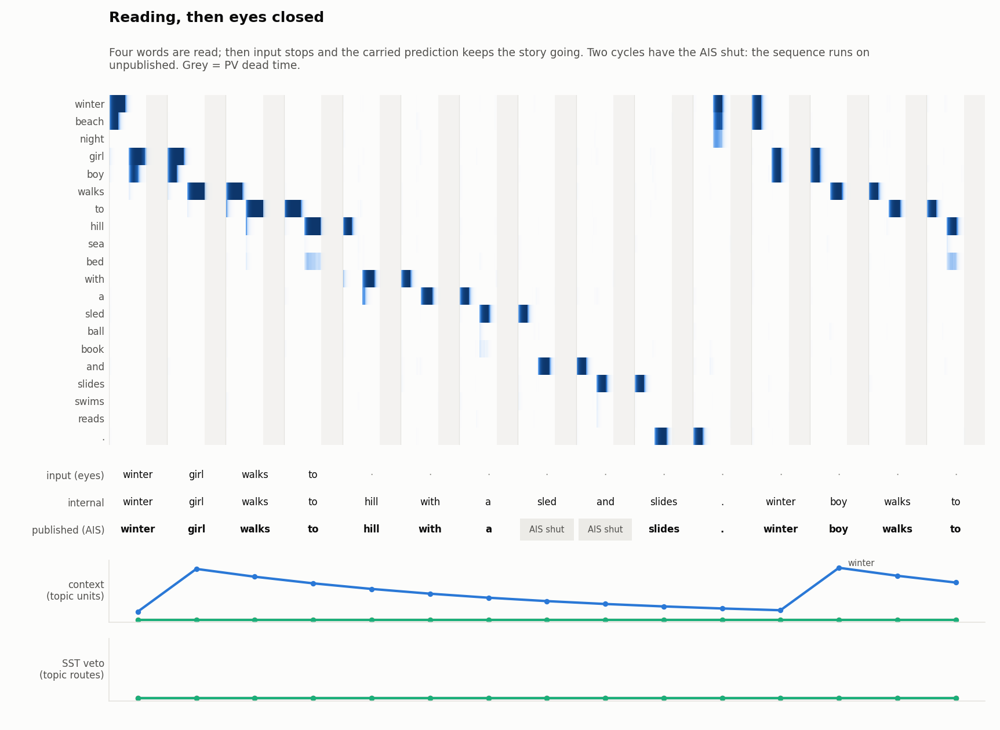
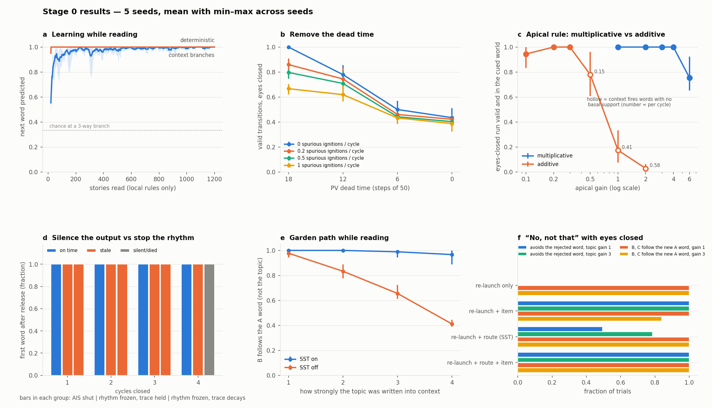
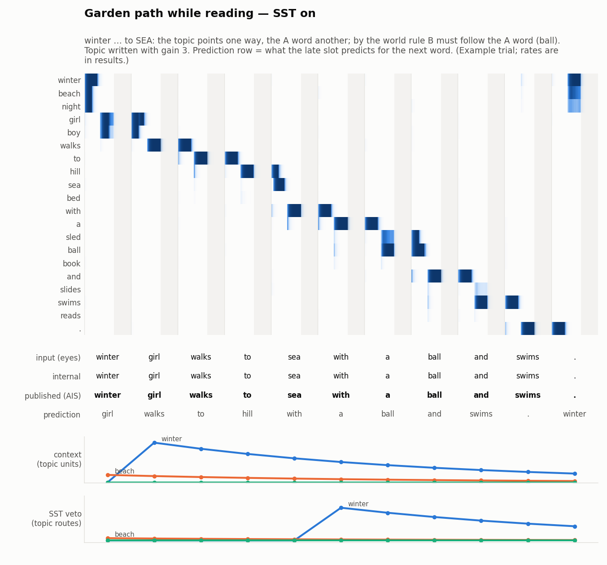
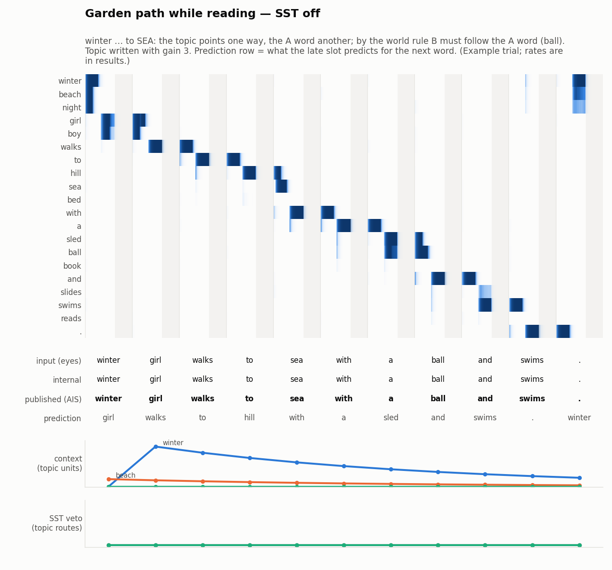
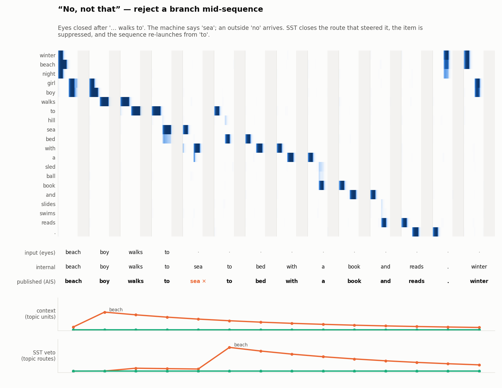
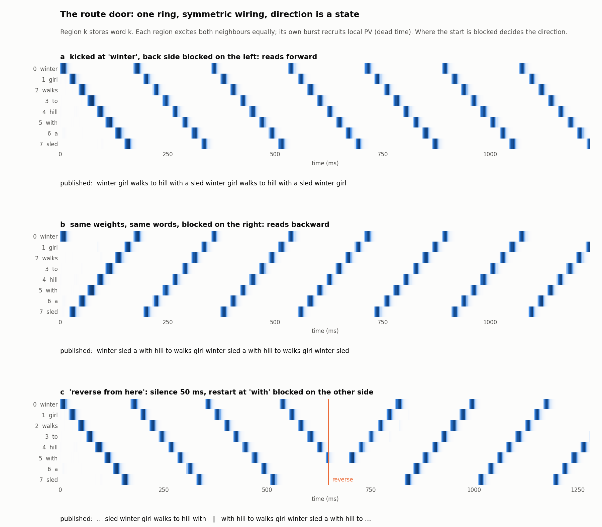
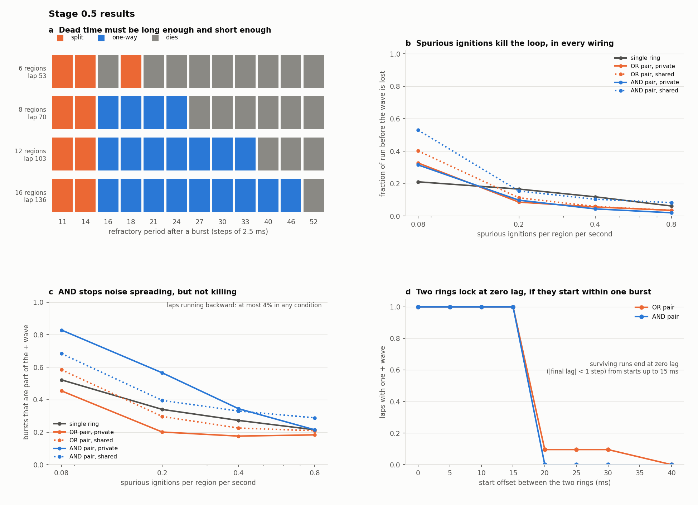
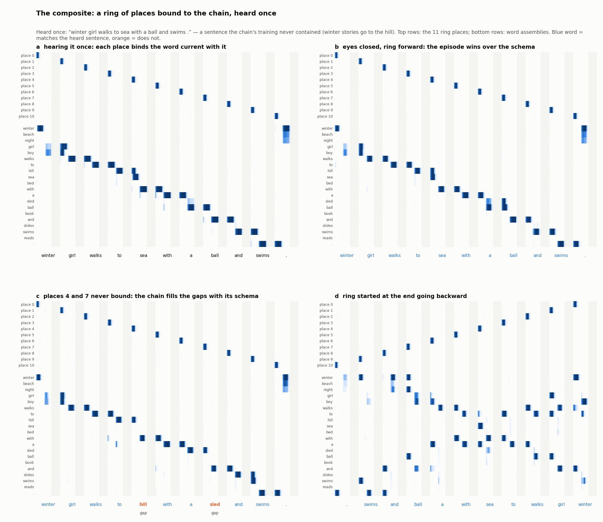
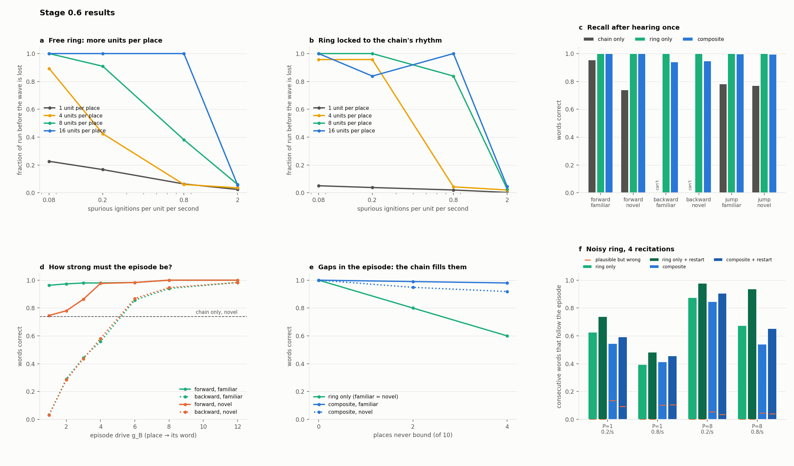
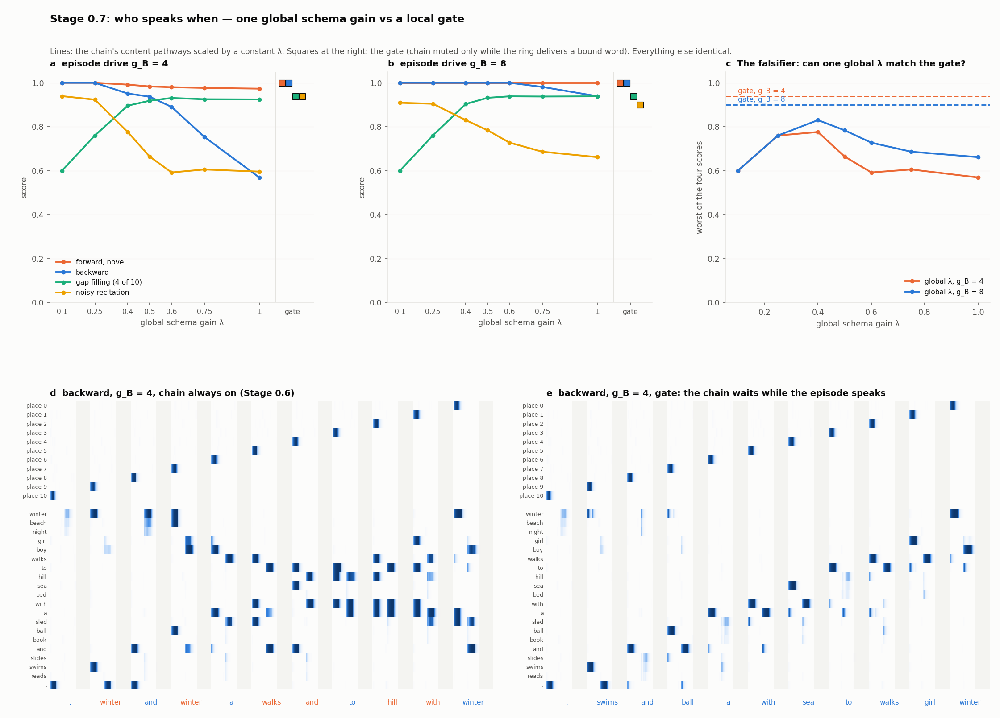

# PaluuAikaIkkunaan (return to time window) — Stage 0: the running sequence

*Claude's build. Sol is building a separate version of the same stage.*

> **Time is locally constructed into computational windows, and different pieces of a neuron
> control what enters, what it means, what gets learned, and what gets allowed to leave.**

Stage 0 is the smallest machine that keeps those pieces separate and lets you watch a sequence
run through them. The machine reads tiny stories one word per rhythm cycle. When the input stops it
keeps telling the story itself. Four controls act on the running sequence, and each ablation below
breaks something different.

This is not a language model and it is not compared to one. It has 20 words.



*Read "winter girl walks to", then eyes closed. Each word shows up twice: late in the previous
window (the prediction) and early in its own window (the current word). The rebound across the grey
dead time carries the prediction into the next window. Two cycles have the AIS shut: `sled` and
`and` still run internally, and the output resumes at `slides`, on time.*

---

## The machine

One rate unit per word assembly. One step is 2.5 ms, and one cycle is 50 steps (125 ms, theta-like),
with one word per cycle.

```
basal_i  = input_i(t) + rebound_i(t) + Σ_j J[j,i] r_j(t − d)          d = 17 steps (one hop)
apical_i = tuft( cos( ctx·(1 − veto), U[:,i] ) )                      in [0, 1], constant per cycle
drive_i  = G · relu(basal_i − θ) · (1 + g_ap · apical_i)              ← multiplicative
u_i      = drive_i − adaptation − lateral inhibition − PV(phase) − item suppression + noise
```

| door | in the code | what it cannot do |
|---|---|---|
| **PV / basket rhythm** | Strong inhibition in the last 18 of 50 steps (dead time). The hop delay is set so exactly one hop fits in an open window. | It can't choose which word comes next. |
| **Apical / tuft** | A slow context trace (words, leaky over ~6 cycles) reaches each assembly only through learned prototypes `U`, through a threshold. It multiplies basal drive. | It can't make a word fire with zero basal support. |
| **SST / Martinotti** | After a failed prediction, SST closes the apical route of the context units that steered it, in proportion to how much they steered it. Decays over ~6 cycles. | It can't touch content, rhythm or output. |
| **AIS / chandelier** | Gates publication of the cycle's current word. | It can't touch internal state. |

**Carry across the dead time.** The assembly most active in the late slot of a window (the
prediction) leaves a trace. That trace rebounds when the next window opens.
- Eyes open: the rebound competes with the arriving word.
- Eyes closed: the rebound *is* the next word.

One mechanism covers "world drives the sequence" and "model drives the sequence".

**Learning** is local, in reading mode only:
- **Transitions `J`:** a consolidating Hebbian rule on consecutive confirmed words (rate `1/n`,
  floor 0.01). Rows become transition probabilities.
- **Context prototypes `U`:** a plateau rule. When the arriving word was not the carried prediction,
  the arriving word's column moves toward the current context, and the failed prediction's column
  moves away from it. No surprise, no learning.
- **The SST circuit is designed, not learned.**

## The grammar

There are 20 words, and every story uses the same 11-slot skeleton:

```
topic  subj  walks  to  A  with  a  B  and  C  .
winter girl  walks  to  hill with a sled and slides .
beach  boy   walks  to  sea  with a ball and swims  .
night  ...          to  bed  with a book and reads  .
```

- **Random branches:** `.`→topic and topic→girl/boy. Context cannot predict these.
- **Context branches:** A, B and C. B and C come *after merged segments* ("with a", "and"), so only
  context that survived the merge can pick them.
- **World rule:** the A word decides B and C. In training the topic always agrees with A. The garden
  path tests break that agreement.

---

## Results

Five seeds, each trained on 1200 stories with local rules only. Numbers are the mean across seeds,
with the min–max range in brackets.



**T0 — learning.**
- Deterministic transitions are predicted 100%, and context branches 100% (cold start from an empty
  context: 100%).
- Random branches sit at chance (0.44 [0.40–0.48]; chance is 0.33 or 0.5 depending on the branch).
- With the apical gain set to 0, context branches fall to chance: 0.31 [0.23–0.34].

**T2 — eyes closed.** Cue with 1, 4 or 7 words, then no input for 33 cycles. All 5 seeds give 100%
grammatical transitions, 100% of branch words in the cued world, and no run dies. The story ends,
and the machine starts a new one on its own.

**T3 — remove the dead time** (panel b). Valid transitions with eyes closed:

| dead time (steps of 50) | 18 | 12 | 6 | 0 |
|---|---|---|---|---|
| no spurious ignitions | **1.00** | 0.78 | 0.50 | 0.43 |
| 1 spurious ignition / cycle | 0.67 | 0.62 | 0.43 | 0.39 |

Without the dead time the second hop fires inside the window, so the sequence skips and several
words share a window (>1 current word in 97% of cycles vs 20% baseline).

Spurious ignitions (a random assembly gets a word-sized input) derail the sequence *even with* full
dead time. The dead time helps at every rate but does not remove the problem.

**T4 — multiplicative vs additive context** (panel c), measured as eyes-closed runs that are valid
and stay in the cued world:
- **Multiplicative** works for gains 1–4 (1.00). It fails at 6 (0.75) because the amplified drive
  starts beating the rhythm. It never fires a word from context alone, but that is by construction.
- **Additive** works just as well in a narrow band (gain 0.2–0.3: 1.00). From 0.5 up, context fires
  words that have no basal support: 0.15, 0.41, 0.58 such intrusions per cycle, and validity falls
  to 0.78, 0.17, 0.03.

So, honestly: a well-chosen additive gain does the job here. The differences are the failure mode
(hallucinated words vs broken timing) and a narrower safe band.

**T5 — silence the output vs stop the rhythm** (panel d). Close for k = 1–4 cycles in the middle of
an eyes-closed run, then release:
- **AIS shut:** the first published word is the one the undisturbed run publishes at that moment,
  100% of trials, all k.
- **Freezing the rhythm:** the story resumes where it stopped (stale) 100% of the time, or, if the
  carried trace decays, dies after 4 frozen cycles.

"Continue computing without emitting" keeps its place in time; stopping does not. The AIS half is
by construction (the AIS never touches state). The informative half is that freezing loses the
place.

**T6b — garden path while reading** (panel e, and the two figures below). Read
`winter girl walks to SEA with a …`. Does the prediction for B follow the A word (ball) or the topic
(sled)? The sweep is over how strongly the topic was written into context:

| topic gain | 1 | 2 | 3 | 4 |
|---|---|---|---|---|
| SST on | 1.00 | 1.00 | 0.99 | 0.97 |
| SST off | 0.98 | 0.83 | 0.66 | 0.41 |

This holds in every seed. When the prediction at `sea` fails, SST closes the winter route, and the
old frame stops steering later branches. Without SST, a strong frame keeps pulling toward sled.

| SST on | SST off |
|---|---|
|  |  |

*Example trial (the first one found where the two differ); the rates are in the table.*

**T6 — "no, not that" with eyes closed** (panel f). After `… walks to` the machine says a branch
word, and an outside "no" arrives. The sequence re-launches from `to`.

| after the "no" (topic gain 3) | avoids the rejected word | B, C follow the new A word |
|---|---|---|
| re-launch only | 0.00 | 1.00 |
| + item suppressed | 1.00 | 0.84 |
| + route closed (SST) | 0.79 | 1.00 |
| + both | 1.00 | 1.00 |

**Suppressing the item is what makes it try something else.** Closing the route alone often leaves
the transition habit to pick the same word again. The route closure is what stops the old frame
from pulling the rest of the story back. At topic gain 1 the new A word's own context already wins
downstream, so the route closure isn't needed there.



---

## Ledger

**Measured, and not built in:**
- The dead time is needed for one word per window.
- Freezing loses the place in time.
- SST protects against garden-path persistence as the framing grows stronger, in every seed.
- To avoid a rejected word you need item suppression. To keep downstream branches consistent after a
  strong frame you need route closure.
- Additive context fails by intrusion above a narrow band. Multiplicative fails by timing at high
  gain.

**True by construction — not findings:**
- Multiplicative apical has zero intrusions.
- The AIS-shut run stays on time.
- The re-launch-from-`to` step and the SST credit rule are designed operations.
- The window timing (hop delay ≈ half a window) was chosen so that one hop fits. The dead-time test
  removes exactly that, so its result depends on this design.

**Weak, negative, or flawed:**
- **Spurious ignitions** cost 14–33% validity even with the dead time. The dead-time
  wave-suppression story from Rytmi is only partly reproduced.
- **Spurious context associations at random branches.** The plateau rule learns context→girl/boy
  associations that don't exist (winter→boy). SST then fires after 53% [21–83%] of random-branch
  misses, closing a topic route for no good reason. It is visible in the "no" figure (small
  beach-veto bump at `walks`). The fix needs a learning rule that can learn "this branch is
  unpredictable". Tried and rejected: column decay, weight-dependent potentiation, and unnormalized
  SST credit. All three weakened the garden-path protection.
- **Shortcut that only a garden path exposes.** At 600 training stories, seed 4 learned a `ball`
  prototype carrying generic "with a" context. Its training accuracy was 100%, because consistent
  stories never punish the shortcut. The garden path exposed it: 0.39 even with SST on. Error-driven
  learning never fixes what it never gets wrong. Training was raised to 1200 stories *after seeing
  this*, and seed 4 then passes. This is tuning on a test outcome, disclosed here.
- **Tuned by hand during development** (against T0 accuracy and eyes-closed validity on seeds 0–1):
  - tuft threshold and width, cosine readout, and context time constant
  - hop delay, window end, dead time and PV strength (PV was raised when apical-amplified drive broke
    through the dead time)
  - carry cutoff
  - SST credit form (changed from max-normalized to proportional after it vetoed on random branches)
- **Deliberately simple:**
  - one unit per word, not distributed assemblies
  - no letters, no emitted-waveform channel
  - context is a bag of recent words
  - the "no" comes from outside, not from a forward model

## Run

```
pip install numpy matplotlib
python -m rttw.experiments   # ~8 min on 2 cores; writes results/results.json, results/weights.pkl
python -m rttw.viewer        # writes figures/
python -m rttw.stage05       # Stage 0.5, ~3 min; writes results/stage05_results.json
python -m rttw.viewer05      # writes figures/ring_viewer.png, figures/stage05_results.png
python -m rttw.stage06       # Stage 0.6, ~6 min; writes results/stage06_results.json
python -m rttw.viewer06      # writes figures/composite_viewer.png, figures/stage06_results.png
python -m rttw.stage07       # Stage 0.7, ~15 min on 2 cores; writes results/stage07_results.json
python -m rttw.viewer07      # writes figures/stage07_results.png
```

`rttw/grammar.py` is the stories, `rttw/machine.py` the machine (all four doors and the learning
rules), `rttw/experiments.py` the tests, and `rttw/viewer.py` the window viewer and the figures.

## What Stage 1 needs, from what broke here

- A context rule that can tell unpredictable branches from predictable ones, before scaling up
  (TinyStories). Otherwise SST fires on noise.
- A grammar where branch words are *shared* across worlds, so content can't carry its own context.
  That is where route closure should matter most, and Stage 0 can't show it.
- Letters as gamma sub-slots inside word windows.
- The emitted-waveform channel (Stage 3 in the plan).

---

# Stage 0.5 — routes and coincidence

*Prompted by two papers:*
- *Ye et al., "Brain-wide topographic coordination of traveling spiral waves" (bioRxiv 2023.12.07.570517 v3).*
  Spirals in mouse cortex sweep the body map in order, around a centre where the local axons lie
  tangentially and match the wave's direction. Mirrored areas rotate opposite ways.
- *Verzhbinsky et al., "Cross-region neuron co-firing mediated by ripple oscillations supports
  distributed working memory representations" (Nature Neuroscience 2026).* Cross-region co-firing
  within 25 ms rises about 30% when distant sites ripple together, with no fall-off up to 220 mm.

Stage 0 has one global clock: every assembly opens and closes its window together. Both papers are
about windows that are local, and about what happens between places. Stage 0.5 asks two questions:

1. **Can the order of a sequence come from the route instead of from learned transitions?**
2. **Does requiring two places to fire together (coincidence) protect a running sequence from noise?**

## The machine: a ring

Eight regions sit on a ring, and region k stores word k.

- **Symmetric wiring:** every region excites both neighbours equally, with a 20 ms hop delay.
- **No global clock.** A region's window opens when a neighbour's burst arrives. Its dead time is
  triggered by its *own* burst, through local PV-like inhibition with time constant `tau_p`.
- **Output:** a region publishes its word when it bursts, so the published sentence is the order in
  which the wave visits the regions.
- **Starting a wave:** drive one region while briefly blocking the neighbour on one side (a one-sided
  block). This is the only thing that chooses the direction.

`rttw/ring.py` also has the two-ring version: two mirrored rings, coupled region to region.
- **OR pair:** input from either ring is enough to fire a region.
- **AND pair:** a region fires only when the wave arrives from both rings inside the same burst.
  This is our stand-in for the co-ripple condition.

In the AND pair, the threshold (0.6) sits between one source (0.5) and two (1.0). The OR pair has the
same weights with a threshold of 0.3.



## Results

Eight seeds per condition unless stated. See `results/stage05_results.json`.

**R2 — direction is a state, not a weight.** Same weights, same stored words:
- The one-sided block on the left reads `winter girl walks to hill with a sled …`.
- The block on the right reads `winter sled a with hill to walks girl …`.
- Both match the expected order in 100% of bursts, for 20+ laps with no input.

For comparison, the Stage 0 chain can't do this at all. Its learned transitions are one-way: the
largest backward weight along a story is 0.00, against a mean of 0.76 forward. Reading a chain
backward would need a second, backward chain to be learned.

**R3 — operations on a running sequence.**
- *Reverse from here:* 50 ms of global inhibition, then a one-sided restart at the current word.
- *Start at a word:* the same restart at any region.

Both give the expected order in 100% of trials. Both are designed operations; the finding is only
that the residual refractoriness left by the running wave doesn't break them.

**R1 — the dead time has to sit in a band** (panel a). Refractory period after a burst, against
ring size:
- **Too short** (≤ 14 steps; one hop is about 9): the neighbour ahead re-excites the region
  behind, the wave splits both ways, and the ring ends in a standing, alternating pattern. This
  lower edge doesn't depend on ring size.
- **Too long:** the wave runs into its own recovering tail and dies. This upper edge moves with the
  ring: the longest working refractory period is about a third of the lap time (8 regions: 24/70
  steps; 12: 33/103; 16: 46/136). A 6-region ring (53-step lap) has no working band at all.

In Stage 0 the dead time kept one word per window. Here it does a second job: it makes a symmetric
wire one-way.

**R4 — noise kills the loop but almost never reverses it** (panels b, c). Spurious ignitions (a
region fires on its own):
- At 0.08 per region per second, the single ring keeps its wave for only 21% of a 7.5 s run.
- Laps running backward stay at 0–4% in every condition. The failure is death, not reversal.
- The mechanism, from traces: an ignition just behind the recovering tail can only spread backward.
  It then meets the main wave head-on and both die.
- This is much more fragile than the Stage 0 chain, which never died. At the same per-assembly rate
  (0.08/s) Stage 0 kept 86% valid transitions.

**R5 — coincidence stops noise spreading, but does not keep the wave alive** (panels b, c).

| 0.08 ignitions / region / s | wave kept (fraction of run) | bursts that belong to the wave |
|---|---|---|
| single ring | 0.21 | 0.52 |
| OR pair, private noise | 0.33 | 0.45 |
| AND pair, private noise | 0.32 | **0.83** |
| AND pair, shared noise | **0.53** | 0.68 |

- **AND stops private noise from spreading:** a region that fires alone in one ring recruits
  nothing, so far more of the bursts are real wave bursts.
- **But it doesn't keep the wave alive.** The private burst leaves a refractory hole in one ring.
  When the real wave arrives, only the other ring's region can fire, which gives one source instead
  of two, so the wave stops at the hole.
- **Shared noise is gentler for the AND pair** (0.53 vs 0.32), because it keeps the two rings in
  step. That confirms the hole is the mechanism.
- At higher rates everything converges to near zero.

So coincidence turns a hallucinated word into a gap. In this model it doesn't fix noise.

**R6 — two rings lock at zero lag if they start within one burst** (panel d). Start the second ring
up to 15 ms late: both OR and AND pairs pull into zero lag (|lag| < 0.03 steps) within the first lap
and keep running. From 20 ms on, the AND pair never starts, and the OR pair dies within a lap or two.
15 ms is about one burst width. The co-ripple paper's coincidence window is 25 ms, but this
tolerance comes from our burst width, not from the paper.



## Ledger

**Measured:**
- The two-sided refractory band, and the upper edge moving with ring size.
- Symmetric wiring plus self-triggered dead time gives a stable one-way route, reversible by the
  start condition alone.
- Noise kills rather than reverses.
- AND coupling rejects spreading noise but not its refractory footprint. Shared noise is gentler
  than private noise for the AND pair.
- Zero-lag locking from offsets under one burst width.

**By construction:**
- Forward and backward reading given a working band.
- The reverse and start-at-word operations (designed; they only had to survive residual
  refractoriness).
- The AND pair's refusal to start from one ring.
- Lap ≈ 70 steps (175 ms, about 5.7 Hz) follows from choosing a 20 ms hop and 8 regions. It lands in
  the spirals' 2–8 Hz band by choice, not as a finding.

**Prior art — none of this is new physics:**
- One-way propagation and re-entry around a ring of excitable tissue is cardiac physiology
  (Mines 1913; Wiener & Rosenblueth 1946), including the vulnerable window behind the tail.
- Phase-gated routing between areas is Fries's communication-through-coherence.
- Reading a stored order in both directions is the chaining-versus-positional question in
  serial-order memory. Positional codes allow backward recall; chains don't.
- Hippocampal reverse replay exists (Foster & Wilson 2006).

What is new here is only the combination with the Stage 0 doors, and the measured failure modes.

**Weak, negative, or flawed:**
- **The ring is fragile.** One region is one unit, so a spurious ignition fires a whole region. A
  population per region, where one unit's noise doesn't make the region refractory, is the obvious
  next test and may change R4/R5 entirely.
- **Coincidence did not help survival.** That was the main hope, and it is negative in this model.
- **Hand-tuned during development:** the burst model (local self-excitation, PV rate and gain), the
  AND threshold, and the one-sided-block kick. The band in R1 is the band *for these burst
  parameters*.
- **Not built:** coincidence on the Stage 0 chain itself. The ring result predicts the same hole
  problem there: a strict AND on the carried prediction would turn a corrupted carry into a stop.

## What this adds to the machine

Two kinds of sequence now sit side by side:
- **The Stage 0 chain:** learned, context-branching, and one-way.
- **The ring:** positional, fixed-order, readable either way, and startable anywhere.

The route (direction and start point) is a fifth door, separate from content, context, rhythm and
publication. The ring also shows that the dead time is doing routing, not only timing.

The obvious composite is next: a ring as the scaffold that the chain's windows are read against.
It's also where the fragility has to be fixed first.

---

# Stage 0.6 — the composite: a ring of places bound to the chain

Stage 0.5 left two kinds of order side by side:
- **the chain:** learned, context-branching, and one-way;
- **the ring:** positional, readable either way, and fragile.

Stage 0.6 puts them in one machine and asks what each one is for. It uses a task that needs both:
hear a sentence **once**, then recall it forward or backward, or jump in at a word.

## The machine

**Populations.** Each ring place is now P units that share one region-level PV. A single unit that
fires on its own moves its place's activity by 1/P. With P = 1 this is exactly the Stage 0.5 ring.

**The ring shares the chain's rhythm.** The chain's PV dead time also silences the ring. A place's
burst arrives at its neighbour during the dead time and is held by a slow synaptic trace until the
next window opens. So one hop = one cycle = one word; this is the ring's version of the chain's
rebound.

To make that lock work, refractoriness is split into two parts:
- a fast PV that ends each burst;
- a slow component triggered when a *whole place's* burst ends.

That way a few stray units don't build up refractoriness (see ledger).

**Hearing once.** The sentence is read eyes-open while the ring runs forward from place 0. Each
place binds, one-shot, to the word that was current while it was active (`B[place, word] = 1`).

**Recall.** Eyes closed. The ring runs, and each active place drives its bound word's *basal* input
with gain `g_B`. The chain (trained Stage 0 weights, 5 seeds) runs at the same time: its rebound,
transitions and apical context act exactly as in Stage 0.
- *Ring only* switches the chain off: no transitions, context or rebound.
- *Chain only* sets `g_B = 0`. It gets the first word as a cue, because it can't start otherwise.

Everything is scored on words 1–10.

Test sentences:
- **6 familiar** stories, matching the training worlds.
- **12 novel** ones that break the world rule. For example, `winter girl walks to sea with a ball
  and swims .` — winter stories in training always go to the hill.



## Results

Numbers are pooled over the 5 Stage 0 weight seeds (C1 and C7 use 6–8 ring seeds). See
`results/stage06_results.json`.



**C1 — populations fix the ring's fragility** (panels a, b). Survival (fraction of run before the
wave is lost) against spurious ignitions per *unit* per second:

| units per place | free ring 0.08 / 0.2 / 0.8 / 2 per s | ring locked to the chain |
|---|---|---|
| 1 | 0.23 / 0.17 / 0.06 / 0.02 | 0.05 / 0.04 / 0.02 / 0.00 |
| 8 | 1.00 / 0.91 / 0.38 / 0.06 | 1.00 / 1.00 / 0.84 / 0.03 |
| 16 | 1.00 / 1.00 / 1.00 / 0.06 | 1.00 / 0.84 / 1.00 / 0.05 |

Everything fails at 2 per unit per second, where several units of one place start firing within a
burst width of each other. One locked P = 16 seed failed at 0.2/s, so that point dips.

The composite tests below use P = 1 unless they say otherwise; noise only enters in C6.

**C2 — forward recall: the episode beats the schema, if it is strong enough** (panels c, d).

| words correct | familiar | novel |
|---|---|---|
| chain only | 0.95 | 0.74 |
| ring only | 1.00 | 1.00 |
| composite, g_B = 1 / 2 / 3 / 4 / 8 | 0.96 / 0.97 / 0.98 / 0.98 / 1.00 | 0.75 / 0.78 / 0.86 / 0.98 / 1.00 |

- **Every error is the schema word.** All 130 chain-only errors at the A/B/C slots of novel
  sentences were the word the topic's world would put there. At weak episode drive the composite
  makes the same errors: 130 of 130 at g_B = 1, 63 of 70 at g_B = 3. Recall regularizes toward the
  learned schema, the way Bartlett's subjects did.
- **The knee is between g_B = 3 and 4.**
- **Even at g_B = 8, the window holds both candidates.** The episode word and the schema word were
  both strongly active in 24% of novel-sentence cycles, against 5% for chain only. The episode word
  is the one that gets said.

**C3 — backward recall: the chain gets in the way.** Ring only: 1.00. The composite needs a much
stronger episode: 0.56 at g_B = 4, 0.86 at 6, 0.94 at 8, 0.98 at 12. The chain predicts the
forward successor every cycle, so two words were both active in 91% of backward cycles. Chain only
can't recall backward at all. (People are also worse at backward recall than forward; that is an
analogy, not a test.)

**C4 — "what came after X?"** Hear X eyes-open; its bound place re-ignites the *next* place (a
designed operation); read the answer.
- ring only: 1.00 / 1.00 (familiar / novel);
- composite: 1.00 / 0.99;
- chain only: 0.78 / 0.77. After a jump the context is only X, so at 'to', 'a' and 'and' the chain
  can't know which world it is in.

**C5 — gaps in the episode: this is what the chain is for** (panel e). Some places are never bound,
as if attention lapsed during hearing:

| places never bound | ring only | composite, familiar | composite, novel |
|---|---|---|---|
| 2 | 0.80 (gaps silent) | 0.99 (95% of gaps correct) | 0.95 (74% of gaps correct) |
| 4 | 0.60 | 0.98 (95%) | 0.92 (80%) |

The chain fills gaps with what usually goes there. That is right for familiar sentences, and it
produces the schema word for novel ones. It is reconstructive memory: the episode supplies what it
has, and the schema supplies the rest.

**C6 — noisy ring, four recitations in a row** (panel f). Measures:
- *episode pairs:* consecutive words that follow the heard sentence;
- *plausible:* wrong but grammatical pairs;
- *silent:* cycles where nothing was said.

A designed restart re-ignites the place after the last word spoken whenever the ring has been
silent for a cycle.

| | ring only | ring only + restart | composite | composite + restart |
|---|---|---|---|---|
| P=1, 0.2/s | 0.63 (31% silent) | **0.74** | 0.54 (0.14 plausible) | 0.59 |
| P=1, 0.8/s | 0.40 | **0.48** | 0.41 | 0.46 |
| P=8, 0.2/s | 0.88 | **0.98** | 0.85 | 0.91 |
| P=8, 0.8/s | 0.67 | **0.94** | 0.54 | 0.65 |

The best recovery comes from the ring restarting from the last word it said. The chain makes recall
fluent: it is never silent. But it fills breaks with plausible wrong words, and sometimes restarts
the ring from one of them. **The chain does not help recover the episode.**

**C7 — checkpoint coincidence does not help.** This tests the idea from Stage 0.5: run the mirrored
rings with OR coupling (robust), and demand AND only at publication (faithful).
- The share of published words that belong to the wave goes from 0.45 to 0.46 at 0.08/s, and from
  0.20 to 0.21 at 0.2/s. It costs 1–7% of the real words.
- The reason: under OR coupling a private ignition spreads into *both* rings within one hop, so by
  the time anything is published it is already shared. The checkpoint only ever catches the very
  first stray burst.
- AND everywhere is still the only version that keeps published words faithful (0.83). It still
  dies just as often (survival 0.32).

Populations (C1) are what actually removed the noise problem.

## Ledger

**Measured:**
- Populations remove the ring's fragility up to about 0.8 spurious ignitions per unit per second.
- Recall regularizes toward the schema below a clear episode-strength knee, and every error is the
  schema word.
- The chain interferes with backward recall (91% two-word cycles).
- The chain fills unbound places correctly for familiar sentences and schematically for novel ones.
- For recovering the episode under noise, restarting the ring from the last word beats having the
  chain on.
- The publication checkpoint changes almost nothing.

**By construction:**
- Ring-only perfection on clean runs (one-shot binding plus a working ring).
- The restart and jump operations are designed.
- The chain-only jump failures at branch words follow from the context reset.

**Tuned by hand during development:**
- **Locking the ring to one hop per cycle** needed three new pieces, searched on clean runs: the
  synaptic trace (tau_s = 10, hop delay 40 steps), and the split refractoriness (fast PV 30 steps;
  slow component 1.5 with tau 180).
- **Why the refractoriness was split.** A single slow PV integrated stray-unit noise into
  refractory holes: the locked P = 16 ring survived only 0.13 at 0.8/s. A PV recruitment
  threshold and squared PV recruitment were tried and rejected; both broke propagation even
  without noise. The slow component was first triggered at burst *onset*, which cut the burst
  itself short, so it was moved to burst *end*.
- **Stronger lateral inhibition** (w_inh 1.5–4), tried to resolve two-word windows, made composite
  recall worse. Stage 0's 0.8 was kept.
- **g_B = 8** was chosen as the main value after seeing the sweep.

**Weak, negative, or flawed:**
- **Saturation.** Units clip at 1, so above about g_B = 4 more episode drive doesn't make the episode
  word stronger, only earlier. Ties are settled by small differences in the early-slot integral.
  The g_B curve is really a curve of how often the episode word gets there first.
- **Scale.** The sentences are tiny. The "novel" sentences break only the world rule, never the
  skeleton, and the binding is a perfect one-shot Hebbian step with no interference between
  episodes. Several heard sentences sharing one ring would be the real test.
- **Checkpoint coincidence (C7):** negative.
- **Recovery (C6):** the chain doesn't help, which was one of the hopes.

## What it means

The two kinds of order have different jobs:
- **The ring is the episode:** this sentence, heard once, in this order, readable either way,
  and restartable from the last thing said.
- **The chain is the schema:** what usually comes next. It fills whatever the episode doesn't
  have, correctly when the world is familiar and schematically when it isn't.
- **The price of having both on at once:** backward recall and recovery get worse, because the
  schema keeps pushing forward and fills breaks with plausible wrong words.

A natural next door is a control that turns the chain's influence down when the task is "say
exactly what you heard", and up when it is "fill in what's missing". That would be the tuft/SST
system's job in the original picture.

---

# Stage 0.7 — who speaks when: one global schema gain vs a local gate

Stage 0.6 ended with a conflict. With the chain (schema) always on, it fills gaps in an episode
well. But it also pushes forward during backward recall, and it fills noise-breaks with plausible
wrong words. The obvious fix is a knob that turns the schema down for "say exactly what you heard"
and up for "fill in what's missing".

Stage 0.7 tests whether a knob is enough, or whether the decision has to be local.

- **Global:** the chain's content pathways (learned transitions + the rebound) are scaled by one
  constant λ, the same for every moment and every task.
- **Gate:** the same pathways are scaled by `1 - (episode drive right now)`, clipped to [0, 1].
  The chain is muted exactly while a ring place is delivering its bound word. It speaks freely
  when the place holds nothing (a gap) or when the ring is gone.

The gate doesn't pick a word. It only decides which pathway may write at that moment. Apical
context is left on in every condition, because it changes susceptibility, not content. Every
condition restarts a silent ring from the last spoken word that the episode actually holds.

**The falsifier:** if some single λ matches the gate on all four tests at once, the gate adds
nothing. The four tests:
- forward recall of novel sentences;
- backward recall;
- gap filling (4 of 10 places unbound);
- noisy recitation (8 units per place, 0.8 spurious ignitions per unit per second, 4 recitations).

There are 18 sentences × 5 weight seeds per recall test, and 36 runs per noise test, each at two
episode strengths (g_B = 4 and 8).



## Results

| g_B = 4 | forward novel | backward | gaps familiar / novel | noisy recitation | worst of four |
|---|---|---|---|---|---|
| ring only (λ = 0) | 1.00 | 1.00 | 0.60 / 0.60 | 0.97 | 0.60 |
| global λ = 0.25 | 1.00 | 1.00 | 0.76 / 0.76 | 0.92 | 0.76 |
| global λ = 0.4 (best global) | 0.99 | 0.95 | 0.94 / 0.85 | 0.78 | 0.78 |
| global λ = 1 (Stage 0.6) | 0.97 | 0.57 | 0.96 / 0.89 | 0.60 | 0.57 |
| **gate** | **1.00** | **1.00** | **0.98 / 0.90** | **0.94** | **0.94** |

| g_B = 8 | forward novel | backward | gaps familiar / novel | noisy recitation | worst of four |
|---|---|---|---|---|---|
| ring only | 1.00 | 1.00 | 0.60 / 0.60 | 0.96 | 0.60 |
| global λ = 0.4 (best global) | 1.00 | 1.00 | 0.94 / 0.86 | 0.83 | 0.83 |
| global λ = 1 | 1.00 | 0.94 | 0.98 / 0.90 | 0.66 | 0.66 |
| **gate** | **1.00** | **1.00** | **0.98 / 0.90** | **0.90** | **0.90** |

- **No single λ works for all four.** Gap filling needs λ ≥ about 0.4. Noisy recitation gets worse
  as λ rises (at g_B = 4, from 0.94 at λ = 0.1 to 0.60 at λ = 1). At the weaker episode strength,
  backward recall collapses too (1.00 to 0.57). The best global setting reaches a worst score of
  0.78 or 0.83.
- **The gate gets each test's best at once.** It fills gaps as well as λ = 1, keeps backward
  recall at 1.00, and keeps noisy recitation close to ring-only. Its worst score is 0.94 or 0.90.
- **The mechanism shows directly.** In backward recall with λ = 1, two words are strongly active
  in 91% of cycles, because the chain keeps pushing the forward word. With the gate it is 0%
  (panels d–e).
- **Remaining cost:** under noise the gate is still a little below ring-only (0.94 vs 0.97; 0.90
  vs 0.96). The chain's filler words after the ring is lost cost a few episode pairs, even though
  the restart resumes from the last true episode word.

## Ledger

**Measured:**
- No global schema gain matches the gate on the four tests together, at either episode strength.
- The trade-off behind that is measured: gaps want a strong schema; backward recall and noisy
  recitation want a weak one.
- The gate removes two-word co-activation in backward recall.

**Not tuned:** the gate has one constant, β = 1. It was the first value tried and was never swept.
The global λ was swept over 7 values, and the tables show its best.

**Prior art — the idea is old:**
- Weighting a prior by whether evidence is present is precision weighting / cue combination (and
  the crudest Kalman gain: all evidence when it exists, all prior when it doesn't).
- Episodic plus statistical memory is complementary learning systems (McClelland, McNaughton &
  O'Reilly 1995).
- Filling gaps with the schema is Bartlett's reconstructive memory (1932).

What's specific here is that the weighting is done by timing inside the window: the episode's
arrival mutes the other pathway for exactly as long as it speaks.

**Weak or flawed:**
- **Binary evidence.** A place either has a bound word or it doesn't. With a wrongly bound word,
  the gate would say the wrong word faithfully. A graded version, gating by binding strength,
  and noisy binding are both untested.
- **The gate reads the episode's drive at the previous step,** so the chain leaks for a step or
  two at each window opening.
- **Where the gate would live in cortex is not claimed.** "Recruited by one input, silences
  another pathway" is SST-like in role only.

## What it means

The episode/schema conflict from Stage 0.6 wasn't a matter of setting one knob right. Each moment
needs a different mix, and the moment itself knows which: the episode is either delivering a word
right now or it isn't. A gate driven by the episode's own arrival gets the best of both, with
nothing tuned.

In the terms this repo started from, this is a door that controls *what gets to write* without
knowing *what* is written.
